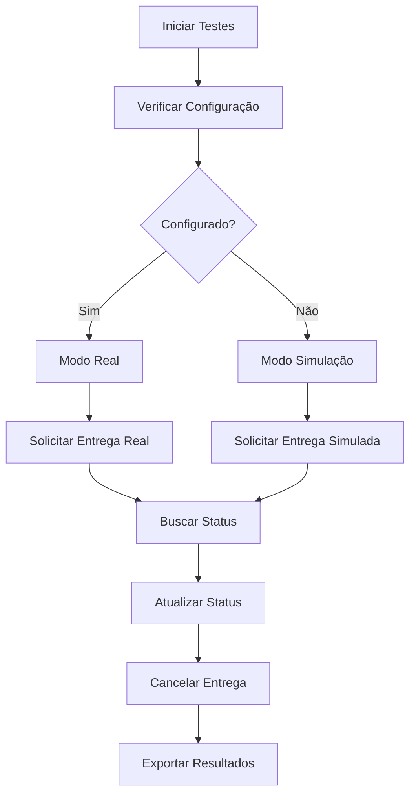

# 🧪 Testes da API iFood - Kalifa Burger Shop

Este documento explica como testar a integração com a API de entrega do iFood no projeto Kalifa Burger Shop.

## 🚀 Início Rápido

### 1. Acessar a Interface de Testes

```bash
# Iniciar o servidor de desenvolvimento
npm run dev

# Acessar no navegador
http://localhost:5173/ifood-test
```

### 2. Executar Testes via Script

```bash
# Executar testes automatizados
npm run test:ifood
```

## 📋 Funcionalidades Testadas

### ✅ Implementadas

- [x] **Verificação de Configuração**
  - Detecta se as credenciais do iFood estão configuradas
  - Fallback para modo simulação quando não configurado

- [x] **Solicitação de Entrega**
  - Envia pedidos para o iFood
  - Recebe ID de entrega e informações do entregador
  - Simulação disponível para desenvolvimento

- [x] **Acompanhamento de Status**
  - Consulta status atual da entrega
  - Recebe localização do entregador
  - Atualizações em tempo real

- [x] **Cancelamento de Entrega**
  - Cancela entregas em andamento
  - Confirmação de cancelamento

- [x] **Webhook de Atualizações**
  - Recebe notificações automáticas do iFood
  - Atualiza status dos pedidos automaticamente

- [x] **Modo de Simulação**
  - Testes sem credenciais reais
  - Dados fictícios realistas
  - Ideal para desenvolvimento

## 🎯 Como Usar

### Interface Web (Recomendado)

1. **Acesse o painel administrativo**
   ```
   http://localhost:5173/admin
   ```

2. **Clique em "Testes iFood"**
   - Botão laranja na seção de ações

3. **Selecione um pedido**
   - Escolha um pedido existente para testar

4. **Execute os testes**
   - Testes individuais ou todos de uma vez
   - Resultados em tempo real

### Script de Linha de Comando

```bash
# Executar todos os testes
npm run test:ifood

# Saída esperada:
# 🚀 Iniciando testes da API iFood...
# ℹ️ Verificar Configuração: iFood não configurado - usando simulação
# ✅ Criar Pedido de Teste: Pedido criado: #test_1234567890
# ℹ️ Solicitar Entrega: Iniciando solicitação para pedido #test_1234567890
# ✅ Solicitar Entrega: Entrega solicitada com sucesso! ID: ifood_test_1234567890_1234567890
# ...
```

## 🔧 Configuração

### Variáveis de Ambiente

Crie um arquivo `.env.local` na raiz do projeto:

```env
# iFood API Configuration
VITE_IFOOD_API_KEY=sua_chave_api_aqui
VITE_IFOOD_MERCHANT_ID=seu_merchant_id_aqui
```

### Obter Credenciais

1. Acesse o [Painel do Parceiro iFood](https://portal.ifood.com.br)
2. Vá para **Configurações > API**
3. Gere uma nova chave de API
4. Anote o **Merchant ID** do seu estabelecimento

## 📊 Resultados dos Testes

### Status dos Testes

- 🟢 **Success**: Teste executado com sucesso
- 🔴 **Error**: Erro durante a execução
- 🔵 **Info**: Informação ou teste em andamento

### Exemplo de Resposta

```json
{
  "deliveryId": "ifood_123_456789",
  "status": "accepted",
  "estimatedDeliveryTime": "2024-01-15T14:30:00Z",
  "deliveryPartner": {
    "name": "João Silva",
    "phone": "(11) 99999-9999",
    "vehicle": "Moto"
  },
  "trackingUrl": "https://tracking.ifood.com.br/delivery/123"
}
```

## 🧪 Modo de Simulação

Quando as credenciais não estão configuradas, o sistema usa simulação:

### Características
- ✅ Não requer credenciais reais
- ✅ Respostas instantâneas
- ✅ Dados fictícios realistas
- ✅ Ideal para desenvolvimento
- ✅ Não afeta a API real

### Dados Simulados
- **Entregadores**: Nomes e telefones fictícios
- **Localizações**: Coordenadas de São Paulo
- **Status**: Aleatórios entre status válidos
- **IDs**: Baseados no ID do pedido + timestamp

## 📈 Fluxo de Teste Completo



## 🚨 Troubleshooting

### Problemas Comuns

1. **"iFood não está configurado"**
   ```bash
   # Solução: Configure as variáveis de ambiente
   echo "VITE_IFOOD_API_KEY=sua_chave" >> .env.local
   echo "VITE_IFOOD_MERCHANT_ID=seu_id" >> .env.local
   ```

2. **"Erro na API do iFood"**
   - Verifique se as credenciais estão corretas
   - Confirme se a conta está ativa no iFood
   - Verifique a conectividade com a internet

3. **"Pedido não encontrado"**
   - Certifique-se de que o pedido existe no sistema
   - Verifique se o Firebase está configurado

4. **"Webhook não recebe atualizações"**
   - Verifique se o endpoint está configurado no painel do iFood
   - Confirme se o domínio está acessível publicamente

### Logs de Debug

```bash
# Ver logs detalhados no console do navegador
# Ou no terminal onde o servidor está rodando
```

## 📤 Exportação de Resultados

### Interface Web
1. Execute os testes
2. Vá para a aba "Resultados"
3. Clique em "Exportar"
4. Arquivo JSON será baixado

### Script CLI
```bash
npm run test:ifood
# Resultados salvos em test-results.json
```

### Estrutura do Arquivo Exportado
```json
{
  "timestamp": "2024-01-15T14:00:00Z",
  "configuration": {
    "isConfigured": false
  },
  "testResults": [...],
  "summary": {
    "total": 8,
    "success": 6,
    "error": 1,
    "info": 1
  }
}
```

## 🔒 Segurança

- ✅ Credenciais em variáveis de ambiente
- ✅ Requisições autenticadas
- ✅ Logs de auditoria
- ✅ Modo simulação seguro

## 📞 Suporte

### Documentação
- [IFOOD_SETUP.md](./IFOOD_SETUP.md) - Configuração completa
- [IFOOD_TEST_GUIDE.md](./IFOOD_TEST_GUIDE.md) - Guia detalhado

### Contatos
- **iFood Suporte**: 0800 777 7777
- **Documentação iFood**: https://developers.ifood.com.br

---

**Nota**: Este sistema de testes é ideal para validar a integração antes de usar em produção. Sempre teste extensivamente antes de implementar em ambiente real. 